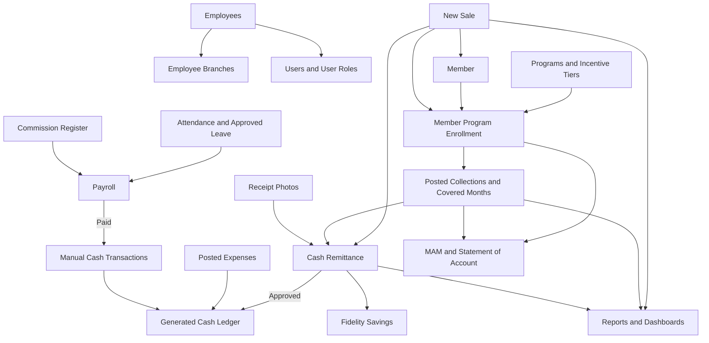
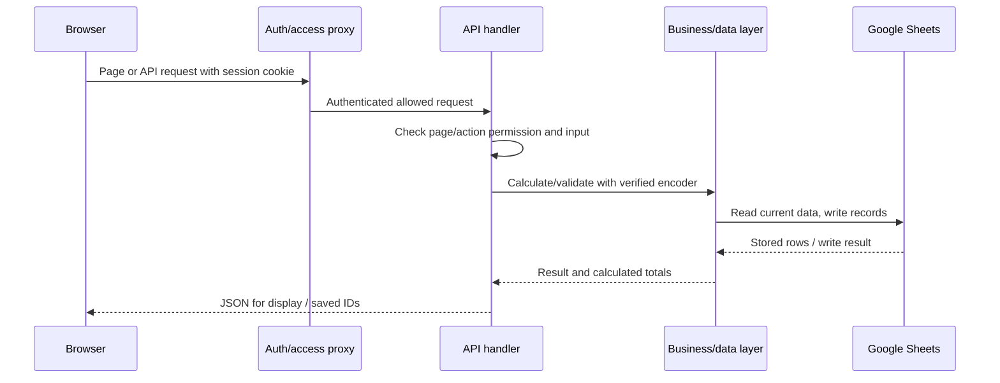

# Dayong System: how the system works

Code review date: **October 4, 2026**. This guide describes the checked-in implementation, with source links so you can verify a rule or find where to change it. It does not certify the current contents or migration state of the live Google spreadsheet. Examples use illustrative amounts, people, and dates.

Read sections 1–5 first for daily operations, sections 6–10 for finance and reporting, and sections 11–15 for administration and maintenance. The [code reference](code-reference.md) lists every page, API handler, library, component, and maintenance script scanned for this review.

## Contents

1. [The main concepts and connections](#1-the-main-concepts-and-connections)
2. [Feature and page directory](#2-feature-and-page-directory)
3. [Programs, rates, and incentive rules](#3-programs-rates-and-incentive-rules)
4. [New Sales workflow](#4-new-sales-workflow)
5. [Collections and member account calculations](#5-collections-and-member-account-calculations)
6. [Remittances and staff accountability](#6-remittances-and-staff-accountability)
7. [Company finance and vendor bills](#7-company-finance-and-vendor-bills)
8. [Commissions and Fidelity](#8-commissions-and-fidelity)
9. [Attendance, leave, and payroll](#9-attendance-leave-and-payroll)
10. [Reports, MAM, SOA, and executive dashboard](#10-reports-mam-soa-and-executive-dashboard)
11. [Employees, accounts, roles, and permissions](#11-employees-accounts-roles-and-permissions)
12. [Corrections, history, audits, and exceptions](#12-corrections-history-audits-and-exceptions)
13. [Architecture, database, and storage](#13-architecture-database-and-storage)
14. [Setup, maintenance, and troubleshooting](#14-setup-maintenance-and-troubleshooting)
15. [Implementation limits and review checklist](#15-implementation-limits-and-review-checklist)

## 1. The main concepts and connections

The system manages member enrollments and payments, employees and attendance, cash turnover, finance, payroll, and reports. Google Sheets is the operational database. Reports are mostly calculated from the stored transactions rather than encoded as separate totals.

| Term | Meaning in this system |
| --- | --- |
| Member | A person and their contact, address, and claimant details. One person can have several programs. |
| Member Program / enrollment | One member's account in one program. DOI, assigned branch/MAS, NOP, payment history, and account standing belong here. |
| Program | A plan's monthly rate, registration rule, total payable, age rules, categories, and incentives. |
| DOI | Enrollment's Date of Inception; it determines the initial month and the day used for advance-coverage timing. |
| MAS | Employee responsible for the enrollment. Operational responsibility is separate from login permissions. |
| Collector | A collection channel using Collector incentive tiers. The batch still uses its assigned MAS and recorded accountable employee. |
| DTO | Direct to Office collection channel; calculations use MAS incentive tiers. |
| Encoder | The signed-in person saving the transaction. The server records their identity and timestamp. |
| NOP | Payment position / installment number. Current code starts new accounts at 1 for the New Sale; first Collection starts at 2. |
| TMD | Monthly program amount multiplied by the account's current NOP. |
| MAM | Member Account Monitoring, derived from enrollments and posted Collections. |
| OR date | Actual receipt date, used for Collections account timing and the incentive deadline. |
| Covered month | Month whose installment a Collection pays. Different from receipt date, remittance date, or encoding date. |
| Remittance | A slip recording the company's expected share, actual cash received, and decision. Created automatically once an entry's receipt photos are attached. |
| Fidelity | Employee's own savings handed over with a remittance; separate from member payments and incentives. |



Three questions have different answers: **what has the member paid**, **what cash does an employee still owe the office**, and **what cash does the company hold**. A posted Collection updates the member's account immediately, but its cash remains outstanding until an approved remittance covers it. Do not record the same money again as a manual cash inflow.

There are also separate statuses: Member status, enrollment Active/Inactive status, calculated account NS/U/ADV/etc., Collection Posted status, and remittance Outstanding/Pending/Returned/Remitted status. Updating one does not automatically mean the others have changed.

## 2. Feature and page directory

Visibility depends on your roles and configured page access. A page you can review may still restrict management actions.

| Page | What you use it for |
| --- | --- |
| `/` | Role-specific dashboard: administration, executive, HR, Finance, Entry Clerk, IT, MAS, or Collector. Workspace selection affects the dashboard. |
| `/new-sales` | Register a new person or add a program to an existing member; save multiple sales in a batch. |
| `/collections` | Batch monthly payments for the selected branch and MAS, with covered months, calculated NOP, role, waiver, and remittance preview. |
| `/todays-entries` | Review New Sales and Collections for a selected day, inspect receipt evidence/date warnings, make authorized corrections, and add receipt photos (to your own entries; administrators to any). |
| `/my-entries` | Your encoded entries by day, week, month or chosen dates: attach receipt photos (one photo can cover several entries), see entries an approver Returned and why, and resubmit them. |
| `/remittances` | Dashboard, Pending Approval, and Reports. Entry Clerks see only what they encoded; approvers see everyone, filter by Entry Clerk, search, and approve or reject one, selected, or all slips. |
| `/members` | Searchable member directory, enrollments and calculated standing, details, and authorized transfers/updates. |
| `/mam` | Month-by-month account monitoring with branch/program/MAS filters and current-status synchronization. |
| `/soa` | Printable Statement of Account for one enrollment. |
| `/reports` | The signed-in Entry Clerk's own reports as Daily, Weekly, Monthly, and Yearly tabs (`?tab=weekly` keeps the open tab), in the company report layout. The clerk also records expenses, bank deposits, and report notes there. The old `/reports/daily`…`/reports/yearly` addresses redirect to the matching tab. |
| `/admin-reports` | Report Review: the same tabs, read-only, for a chosen Entry Clerk, with the entry checklist and reviewer remarks. |
| `/audit` | Daily, weekly, monthly, yearly Entry Clerk report audits and audit summaries. |
| `/history` | Creation history, logged edits/deletions, and authorized transaction corrections. |
| `/exceptions` | Administrator review of dates, amounts, duplicate entries, missing member details, overdue cash, and backdating. |
| `/expenses` | Company expense forms and posted outflows; authorized voiding with a reason. |
| `/cash-transactions` | Consolidated cash ledger plus other manual inflows/outflows. |
| `/vendor-payables` | Vendor invoices, outstanding balances, and partial/full payment tracking. |
| `/commissions` | Earned incentive comparison and the commission register; create and mark commissions Paid. |
| `/fidelity`, `/fidelity/me` | Staff savings, contributions, pending amounts, locked balance, withdrawals, and separation releases. |
| `/payroll` | Pay profiles, Draft runs, adjustments, approval, payment, printable payslips. |
| `/employees` | Staff register, employment status, operational roles, multiple branches, and primary branch. Administrators can change an Employee ID; every reference follows (section 11). |
| `/attendance` | Your current-day time-in/time-out and attendance calendar. |
| `/attendance-reviews` | Management records Absent or AWOL where appropriate. |
| `/attendance-tracking` | Staff totals and daily board, with authorized lateness/time-out corrections. |
| `/leave-requests` | Submit and review your own leave requests. |
| `/leave-approvals` | Authorized approval/rejection; approved leave creates attendance records. |
| `/programs` | Plan details, categories, fees, age/amount rules, incentives, and authorized maintenance. |
| `/branches` | Branch directory and authorized maintenance. |
| `/master-data` | Shared overview of master records. |
| `/user-accounts` | Employee login accounts, role assignments, activation, and one-time password issuance/reset. |
| `/roles` | Role definitions, management permission flags, and configured page access. |
| `/settings` | Profile/password and organization controls exposed to the signed-in user. |
| `/login` | Employee ID and password sign-in. |

Sources: [page catalog](../lib/page-catalog.ts), [navigation](../lib/navigation.ts), [page/API index](code-reference.md).

## 3. Programs, rates, and incentive rules

A program contains a stable ID, code/name, monthly `basePay`, status, description, category, registration-fee rule and amount, optional `payBalanceTotal`, age restriction, New Sale incentive, and amount-editability flags. Despite its name, program `basePay` means a **member's monthly installment**, not an employee salary.

Program categories organize plans; they do not change the payment math. Inactive programs are excluded from new enrollment selection. Age-restricted enrollment uses age in whole years **today**, not the stored age text: subtract one year if the birthday has not occurred yet. A restricted program needs a minimum age; its maximum can be blank. Both limits are inclusive.

### Amount locking

- By default, New Sale amount is fixed at the registration amount when a registration fee is required; otherwise it is one month's base pay.
- Programs can allow New Sale amount editing explicitly. The server enforces the fixed amount when editing is disabled.
- A Collection normally equals the monthly installment multiplied by selected covered months. A collection-editability setting exists, but server payment validation still requires whole installments and only permits excess for an exact payoff. Editing does not authorize arbitrary partial installments.

### Collection incentives and company share

Tiers are specific to program, incentive role (`MAS` or `Collector`), and inclusive NOP range. A percentage is stored as, for example, `20` for 20%. Each paid NOP must match **exactly one** applicable tier. Missing or overlapping matches block the calculation.

Let `B = monthly base pay`, `M = mark-up`, `I = incentive`, and `r = percentage / 100`:

```text
Percentage incentive: I = (B − M) × r
Fixed incentive:      I = configured fixed amount
Company remittance:   R = ((B − M) − I) + M = B − I
```

The mark-up always goes to the company. `M` must be between zero and `B`, and `I` cannot exceed `B − M`. Currency calculations use centavos and rounding; summing independently calculated installments preserves tier changes.

**Example:** monthly due PHP 350, mark-up PHP 50, MAS rate 20%: incentive is `(350 − 50) × 20% = PHP 60`; company share is PHP 290. Three installments at that tier produce PHP 1,050 gross, PHP 180 incentive, and PHP 870 company share.

Branch overrides apply **per role**. If a branch has any own MAS tiers, those replace all base MAS tiers there; Collector tiers still use base rules unless separately overridden. This is replacement, not gap-filling: complete every NOP range that branch needs.

### New Sale incentives

| Program rule | New Sale incentive |
| --- | --- |
| Registration required, fixed incentive | Configured fixed amount, capped at amount paid. |
| Registration required, percentage incentive | Amount paid × configured percentage. |
| Registration required, no incentive configured | Zero. |
| No registration fee, at least one full month paid | Month-1 MAS tier on one monthly installment; any amount above that month goes to the company. |
| No registration fee, less than one full month paid with editing enabled | Zero. |

New Sale company share is amount paid minus its calculated incentive. The current code supports these incentives; earlier documentation describing all New Sale incentives as zero is outdated.

Sources: [remittance formulas](../lib/remittance.ts), [tier validation/storage](../lib/program-incentive-store.ts), [amount rules](../lib/program-amount-lock.ts), [age rules](../lib/program-age.ts), [program CRUD](../lib/master-data-crud.ts).

## 4. New Sales workflow

1. Select an active branch and an active accountable employee assigned to it. Staff need not hold a MAS login role to sell as a MAS.
2. Select an existing member when the person is already registered. Otherwise enter personal, contact, complete address, and claimant information. Beneficiaries are saved separately and each needs surname, first name, and relationship.
3. Select an active program, DOI, application number/date, payment information, and amount. Registration requirements come from the program rather than the submitted fee flag.
4. Add more sales if needed. The same new person can enroll in several programs in one batch: the person row is created once, with separate enrollments and Sales rows.
5. Enter the **control total from the turnover sheet**, plus any batch Fidelity or separately tracked penalty.
6. Save. Existing member details confirmed in this form become their current member record. New member, enrollment, sale, and beneficiary records are written as needed, with encoder metadata.
7. Attach the receipt photo in My Entries or Today's Entries. Once it is attached, the sale goes to Pending Approval on its own (section 6). Saving a sale does not itself make the cash an approved company inflow.

Duplicate protections normalize application numbers by removing spaces/dashes/punctuation and ignoring case. A number is used only once system-wide. The person duplicate check uses normalized surname, first name, and birthdate; middle name is ignored. Existing members cannot enroll in the same program again, including within the batch.

The control total compares the sum of **member payment amounts** in centavos, not those amounts plus Fidelity or penalties. More than one day of backdating requires a reason of at least five characters; dates are checked against remittance date and today.

Unsaved forms use this browser tab's `sessionStorage`: they survive navigation/refresh but are not database records. Sign-out clears drafts. A closed tab is not a reliable way to preserve them.

The server pre-validates the batch before writes, but New Sales writes several tables sequentially. A network failure after some writes can leave a partial batch; inspect member/enrollment/sale records before resubmitting.

Sources: [Sales API](../app/api/sales/route.ts), [double-entry guards](../lib/duplicate-entries.ts), [entry controls](../lib/entry-controls.ts), [draft storage](../lib/use-form-draft.ts).

## 5. Collections and member account calculations

### Saving a payment

Select branch, assigned MAS/accountable employee, channel (`MAS`, `Collector`, or `DTO`), remittance method/reference, and Date Remitted for the batch. Select the member's enrolled program. The account must match that branch and MAS; a historical transfer does not authorize collecting under the old assignment.

Choose covered months. NOP continues from the account automatically. For a new account with September DOI, New Sale is NOP 1; the first Collection starts in October at NOP 2. October–December covers three months and NOP 2–4. At PHP 350 per month, amount is PHP 1,050.

Server validation checks stored history **and earlier payments pending in this batch**. It rejects:

- Forfeited accounts, including attempts to bypass forfeiture with a waiver.
- Invalid/future OR dates, dates before DOI, or dates before the most recent recorded payment.
- Duplicate OR numbers across posted Collections, or repeats within the batch. Numbers are normalized like application numbers.
- Missing channel, OR number, method reference when required, or active branch/employee assignment.
- Covered months not starting at the next uncovered month, repeated coverage, or skipped months.
- NOP not starting at `nextNop`, or NOP length not matching inclusive month count.
- Less than the full installment total; excess is allowed only if cumulative Collections plus this payment exactly equal the configured payoff total.
- Missing waiver when temporarily suspended, missing required backdate reason, or a control total mismatch.

Months and NOP cannot overlap. One month's PHP 350 installment cannot be paid as PHP 100. Paying one of two overdue months is allowed; it leaves another month overdue. Continuous coverage permits catching up and then paying ahead in the same transaction.

The Collections save appends all rows and updates affected account statuses in one Sheets `batchUpdate`, first widening the sheet's grid if a row has more columns than the sheet. Each save has a batch ID, and its remittance must include all outstanding cards from that batch. The batch's Date Remitted is stored on every row (Collections AO). The payment's posted status and outstanding cash status are stored separately.

The form takes an optional receipt photo for the batch. When one is chosen, it is attached to every Collection of the batch right after saving, which sends the batch to Pending Approval. Without it, the clerk attaches it later in My Entries or Today's Entries. The form no longer offers Cash received in full: Entry Clerks do not approve their own cash.

### NOP, TMD, and coverage

```text
Covered month count = monthIndex(to) − monthIndex(from) + 1
nextNOP             = highest allocated NOP (minimum 1) + 1
nextMonth           = month after last covered month, or month after DOI
TMD                 = monthly base pay × current NOP
```

New Sale gives the minimum NOP of 1, but it is **not inserted as a synthetic Collection allocation**. Collection coverage/history contains actual Collections only. An allocation maps each month to its NOP, installment amount, and source payment ID; an excess payoff is not spread into fictitious monthly payments.

Historical coverage starts from the first stored Collection month when one exists. Gaps, bad NOP ranges, and overlapping months are flagged for review rather than silently repaired. This matters for imported accounts: the system does not assume every old installment was recorded.

### Calculated payment status and displayed balance

Only posted Collections with OR date on/before the calculation date count. With collections, unpaid months are counted from the first stored covered month through the calculation month. Status follows these rules:

| Status | Meaning | Displayed balance multiplier |
| --- | --- | --- |
| NS | No Collection yet; new-account state. | 1 × monthly rate |
| U | Collections cover all due months through this month. | 1 × monthly rate |
| ADV | No due month unpaid, and latest covered month is after this month. | 0 |
| 60D | One unpaid month. | 2 × monthly rate |
| 90D | Two unpaid months. | 3 × monthly rate |
| 120D | Three unpaid months. | 4 × monthly rate |
| 150D | Four or more unpaid months; label caps here. | 5 × monthly rate |
| Paid | Positive payoff total reached by sum of qualifying Collections. | 0 |
| Forfeited | Stored forfeiture marker or timing threshold reached, unless Paid takes precedence. | `null`, displayed as unavailable |

**Displayed balance is a status-based figure, not an exact arrears ledger.** At PHP 350, 60D displays PHP 700 despite representing one unpaid month. TMD is also not the sum of Collections. Read SOA history and unpaid-month count when reconciling real payments.

The payoff calculation uses Collections, **excluding the New Sale amount**. Current `validatePayment` explicitly blocks Forfeited but has no separate Paid-account block; status labels are not a substitute for checking remaining balance.

### Suspension and forfeiture clock

Start with the latest actual Collection OR date, or DOI before any Collection. Advance coverage can move that anchor forward to **DOI's day in the last advance-covered month**. A nonexistent day is clamped to the month end.

```text
suspension date = anchor + 2 calendar months
forfeiture date = anchor + 6 calendar months + 1 day
```

On/after suspension, another payment requires `If Suspended = Waiver`. Other dropdown values do not satisfy this rule. On/after forfeiture, payment is blocked. These rules apply to each enrollment independently; payment to another program does not reset the clock.

**Example:** DOI September 15; September receipt covers through November. Anchor becomes November 15, suspension begins January 15, and forfeiture begins May 16. The receipt remains dated September; no future Collections are invented.

Status is calculated on reads, updated on Collection saves, and persisted by MAM's **Sync current statuses** action. There is no background status scheduler.

Sources: [account rules](../lib/account-rules.ts), [Collections API](../app/api/collections/route.ts), [account loading/commit](../lib/account-data.ts). The older `getNextNOP` helper in [calculations.ts](../lib/calculations.ts) returns 1 with no collections; the active account workflow above uses `accountState` and starts Collections at 2.

## 6. Remittances and staff accountability

New Sales and Collections enter the cash workflow as **Outstanding**. Legacy entries that cannot be mapped reliably can appear as **Needs Historical Review**. Outstanding, Pending Remittance Approval, and **Returned** entries all remain in accountability totals.

### Expected cash and deadlines

Ordinarily an entry owes its saved company share. Staff keep their incentive only if cash is received by **10:00 AM Manila time the day after the OR/application date**. Exactly at 10:00 is still within the deadline. This is based on a date-only receipt and the fixed cutoff, not 24 hours after an actual sale time.

```text
Entry cash due = saved company share, within deadline
               = full member amount, after deadline if there was an incentive
Slip expected  = sum(entry cash due) + batch Fidelity
Slip difference = actual cash received − slip expected
```

Positive slip difference means overage; negative means shortage. This sign is the **reverse of operational-report difference**. No valid receipt date means the deadline helper does not apply forfeiture; review bad dates in Exceptions.

**Example:** member pays PHP 350, company share PHP 290, employee adds PHP 100 Fidelity. Timely expected cash is PHP 390. Late expected cash is PHP 450: PHP 350 full payment plus PHP 100 Fidelity. A separately recorded penalty is not added to the persisted slip expected amount.

Penalty and Fidelity are saved once on a batch's first entry to avoid repetition. Fidelity has no contribution limit and is the employee's own money; it does not reduce their incentive. Penalties are recorded separately from member payments. Some inline comments describe penalties as added to turnover, but `createCashRemittance` currently excludes them from expected cash—use that actual formula when reviewing slips.

### Slip workflow

Entry Clerks no longer build slips. Entries reach approval on their own (`submitReadyEntries` in [remittance-workflow.ts](../lib/remittance-workflow.ts)):

1. **Encode.** Saved entries are Outstanding; My Entries shows them as *Needs receipt photo*.
2. **Attach receipt photos.** Each upload (Collections form, My Entries, or Today's Entries) submits whatever is ready: a Collections batch as one slip once **every** Collection in it has a photo, New Sales one by one. The slip is created by "System" (so any approver may decide it), expects exactly the entries' cash due plus any batch Fidelity, and records actual = expected. Its date is the batch's Date Remitted; its time is the encoding time when encoded that day, otherwise 23:59. Entries become **Pending Remittance Approval**.
3. **Approve.** Approvers check each slip against its receipt photos and approve one, the selected slips, or all. Only slips whose items all have photos can be approved. Approval changes the slip to **Approved**, entries to **Remitted**, and the actual received amount becomes a finance ledger inflow.
4. **Reject.** One reason covers every slip rejected together. The slip becomes **Rejected** and its entries **Returned**, keeping the link so My Entries shows the reason. Incentives forfeited on the rejected slip are restored. The clerk fixes the entries (Returned amounts may be corrected) and resubmits; replacing a photo also resubmits. Resubmitting reopens the whole returned batch, which then goes back through step 2.

Late slips update saved company share to the full member amount and record forfeited incentive. Reports and incentive comparisons then see zero retained incentive for that item.

Remittances has three tabs: Dashboard (cash to account for by Collector/MAS, entries waiting for a receipt photo, returned entries), Pending Approval, and Reports (outstanding cash aging and approved/rejected records). An Entry Clerk sees only entries they encoded and slips containing them; approvers see everyone and may filter by Entry Clerk (`?clerk=`) and search.

Ordinary PATCH approval/rejection requires `canManageUsers` and accepts a list of slip IDs; each is decided separately and failures are reported per slip. The submitting user normally cannot decide their own slip; automatic slips are submitted by "System", and the explicit exception remains a user holding both Administrator/Admin and Entry Clerk roles. Creating a slip already approved (**cash received in full**) is limited to approvers and does not wait for receipt photos; the manual slip screen was removed from the UI.

Cash count uses PHP 1,000, 500, 200, 100, 50, 20, 10, 5, and 1 denominations. If a slip supplies a count, it must equal actual cash. No current screen collects a count, since slips are created automatically.

### Receipt evidence

Photos are optional when saving and can be added any time from My Entries or Today's Entries; adding one is what sends ready entries to approval. Photos are compressed in the browser to grayscale WebP/JPEG, at most 1280 pixels and 80,000 bytes. The server stores base64 in `Receipt Photos`, split into up to four 45,000-character chunks. One photo can cover multiple entries; the latest linked photo is shown. Old uploads are retained. There is no external image-storage service in this workflow.

Sources: [cash workflow](../lib/remittance-workflow.ts), [deadline](../lib/remittance-deadline.ts), [Remittances API](../app/api/remittances/route.ts), [photos](../lib/receipt-photos.ts), [denominations](../lib/cash-count.ts).

## 7. Company finance and vendor bills

### Consolidated cash ledger

The cash ledger is assembled from approved Remittances as inflows, posted Expenses as outflows, and manual Cash Transactions. Approved remittance actual cash includes Fidelity when received with the batch. It is company-held cash, but Fidelity is separately tracked as employee savings.

```text
Cash balance = opening cash balances
             + approved actual remittances
             + posted manual inflows
             − posted expenses
             − posted manual outflows
```

The executive cash-position calculation includes transactions through today and opening balances of active cash accounts. Approved remittances are assigned to Cash on Hand in the generated ledger. Expense outflows use the selected Paid From account, defaulting to Cash on Hand.

Manual Cash Transactions are for additional movements such as capital, withdrawals, deposits, adjustments, and correcting cash records. Recording an approved Remittance again here would double-count cash. A transfer between company cash accounts needs appropriate paired movements if entered manually; there is no inferred second side in `createCashTransaction`.

Expenses require branch, date, account/category, purpose, amount, and approved-by choice. Supporting-document checklists record Voucher/Invoice/Receipt/MC Minutes/Other **names**, not uploaded files. Payee, payment details, invoice/receipt reference, and remarks provide supporting information. An approver name on an expense form is recorded text, not a separate electronic approval state machine.

Expenses and manual cash records are voided with a reason rather than deleted. Voided records stay in history and are excluded from posted totals. Authorized voiding currently uses the broad `manage_users`/administrator guard.

### Vendor Payables

An invoice starts Outstanding with `amountPaid = 0` and `balance = invoice amount`. Each payment must be positive and no larger than remaining balance.

```text
amountPaid after payment = previous amountPaid + payment
balance = invoice amount − amountPaid
status = Paid when balance is zero; otherwise Partially Paid
```

**Current connection limit:** paying a Vendor Payable updates its register, timestamp, and payment account; it does **not** automatically create an Expense or Cash Transaction. Record the actual cash movement consistently when needed. Avoid also entering an expense for an invoice without understanding that executive operating costs already include vendor invoice amounts.

Sources: [finance ledger](../lib/finance-data.ts), [payables/cash accounts](../lib/finance-operations.ts), [executive finance](../lib/executive-analytics.ts).

## 8. Commissions and Fidelity

### Incentive versus commission register

An incentive is calculated on an entry and normally retained by staff before turnover. The **earned commissions** view compares New Sale and Collection incentives with the manual Commission register. It matches people to employees by normalized name, so consistent names matter. Its period figures come from operational reports and are not restricted to approved/remitted entries in the same way as payroll's earned-reference figure.

A Commission record is a separate payable record with employee, period, gross, deduction field, net, and Pending/Paid status. The storage function still accepts a legacy Fidelity deduction:

```text
Commission register net = gross incentive − entered Fidelity deduction
Current earned comparison net = earned sale + collection incentives
```

Current Fidelity policy says employee savings are separate and should not be deducted from earned incentive. The legacy register field and old rows still exist; review them before payment.

Commission records are not automatically created for each sale/Collection. Payroll includes eligible **Pending Commission records**, not every calculated incentive. Do not pay retained incentives again just because an earned comparison lists them; review what a Commission record represents.

Marking a commission Paid directly updates its register and timestamp/reference; it does **not** automatically post a cash ledger outflow. Paying through Payroll does create the payroll cash movement and marks included commissions Paid.

### Fidelity savings

Only **Approved** Remittance contributions count toward available Fidelity. Pending Approval/Discrepancy contributions are shown separately; rejected contributions do not become savings. Withdrawal/release records reduce the approved balance.

```text
Balance      = max(0, approved contributions − recorded withdrawals)
Locked       = min(balance, PHP 10,000)
Withdrawable = max(0, balance − PHP 10,000), while employed
```

PHP 10,000 is the locked portion, **not a lifetime contribution cap**. Staff may continue adding money. Active employees can withdraw only the excess; once employment status is no longer Active, a Separation Release pays the whole remaining balance. Old Claim records still count as paid out.

**Example:** PHP 12,500 approved savings means PHP 10,000 locked and PHP 2,500 available for excess withdrawal. On separation, the full remaining approved balance may be released.

Fidelity withdrawal records currently do **not** automatically post cash outflows; the savings register and finance ledger need reconciliation. The withdrawal function's recorded date uses UTC date text, while operational cutoffs use Manila time.

Sources: [earned comparison](../lib/earned-commissions.ts), [register](../lib/finance-operations.ts), [Fidelity](../lib/fidelity.ts).

## 9. Attendance, leave, and payroll

### Attendance and calendar

Regular attendance uses Manila time, Monday–Saturday, scheduled **08:00–17:00**. Sunday clocking is blocked. Time-in requires an assigned primary attendance branch and no existing record for that day. Time-out requires a time-in and no previous time-out.

```text
Late minutes      = max(0, time-in − 08:00)
Worked hours      = max(0, time-out − time-in) / 60
Overtime hours    = max(0, time-out − 17:00) / 60
Undertime minutes = max(0, 17:00 − time-out)
```

Hours are rounded to two decimals. Worked hours are elapsed clock time: the current calculation does not subtract a lunch break. Payroll uses paid-day counts and the pay profile's hours/day rather than worked hours to price the base wage.

Attendance Review can mark Absent/AWOL where no clocked or leave record blocks the action. The daily tracking board separates On time, Early, Late, Absent, AWOL, On leave, Not clocked in, and Non-working day. Authorized management/HR can adjust lateness and complete missing time-out with notes; Finance primarily reviews.

The calendar supports holiday records and branch-specific or all-branch non-working declarations. **Adding a holiday does not close attendance**; a closure declaration does. Declaring a closure cancels existing Present clock-ins in the affected branches and preserves the original times in notes. Removing a closure reopens the date but does not restore those clock-ins. Holiday templates are a starting list, with some movable dates explicitly marked estimated.

Automatic absences are demand-driven. On opening relevant attendance/payroll pages after a day finishes, the system records missing attendance for active employees as Absent, skipping Sundays and declared closures. The first run sets `auto_absent_from`; older history is not rewritten. It closes at most 62 days per run and retains a progress marker. There is no midnight background scheduler.

### Leave

Employees submit type, date range, and reason. Requests start Pending, then become Approved or Rejected. Only Pending requests can be decided. Approval writes the decision and creates Leave attendance on Monday–Saturday dates; this helper does not separately exclude declared closures. Existing clocked attendance is skipped rather than replaced. Payroll pays approved leave only if that run's setting permits it.

The request review and attendance writes are sequential; inspect both if approval fails part-way. There is no built-in statutory leave-credit accrual calculation described by these modules.

### Payroll setup and formulas

Each employee needs an active pay profile: Daily, Monthly, or No Base; commission eligibility; hours per day; and overtime multiplier. Active employees without a profile are skipped and reported as needing setup. Default hours/day is 8 and overtime multiplier is 1.25.

```text
Daily profile rate = entered daily rate
Monthly daily rate = monthly salary × 12 / 313, rounded to centavos
Hourly rate        = daily rate / profile hours per day
Overtime pay       = Present-row OT hours × hourly rate × OT multiplier
Late deduction     = Present-row late minutes × hourly rate / 60
Undertime deduction = Present-row undertime minutes × hourly rate / 60
```

The 313 factor is the implementation's Monday–Saturday conversion. These are configured payroll rules, not a claim that the system automatically implements every legal payroll requirement.

| Payroll base method | Calculation |
| --- | --- |
| Attendance | `(Present days + payable approved Leave days) × daily rate`. Absences reduce paid-day count; there is no second absence subtraction. |
| Scheduled | All Monday–Saturday dates in the inclusive period × daily rate. If enabled, subtract recorded Absent/AWOL and unpaid Leave days × daily rate, capped at base pay. |

Scheduled working-day count only excludes Sundays. It does not separately subtract holiday/closure days; a missing attendance row is not itself an absence deduction. Confirm the chosen method when reviewing holiday pay.

Commission inclusion requires a commission-eligible profile, include-commissions enabled, a Pending record whose period ends on/before payroll end, and no reservation in another live payroll. The lower bound is not limited to payroll start, so older unpaid commissions can be included.

```text
Gross earnings = base pay + overtime + commissions + additions
Deductions     = late + undertime + absence deductions + adjustment deductions
Net pay        = max(0, gross earnings − deductions)
Shortfall      = max(0, deductions − gross earnings)
```

Additions include bonuses, allowances, 13th month pay, holiday pay, and back pay. Deductions include contributions, tax, loans, company programs, advances, and accountability. **SSS, PhilHealth, Pag-IBIG, withholding tax, holiday premium, and 13th month amounts are entered by Finance; the app does not calculate official tables automatically.** Company-program deductions require a program and save its identity in the reason; they do not create a member Collection automatically.

**Example:** PHP 600 daily, 8 hours/day, 10 payable days, 2 OT hours at 1.25, 30 late minutes, PHP 200 bonus, PHP 100 deduction: base PHP 6,000, OT PHP 187.50, late PHP 37.50, gross PHP 6,387.50, deductions PHP 137.50, net PHP 6,250.

### Payroll workflow

1. **Draft:** snapshot rates and calculate lines. Recalculate replaces old lines rather than rewriting history. Add/remove adjustments; removed rows remain marked removed.
2. **Approved:** locks amounts. A different Finance user or an Administrator approves; Administrator may approve their own preparation.
3. **Paid:** record pay date, active cash account, branch, and reference. A positive net total posts one Payroll Cash Transaction outflow and marks linked commissions Paid. A zero-net run does not need a cash outflow.
4. **Void:** available for Draft/Approved with a reason; retains the run and releases commission reservations. Paid runs need correcting cash transactions.
5. **Delete:** Draft only; removes run/lines/adjustments with deletion audit support. Approved/Paid are protected.

Non-void payroll periods cannot overlap, even if intended for different staff. Earned Incentive reference is informational; it is not added to pay. Each line has a printable payslip and retains the rate snapshot used.

Sources: [attendance API](../app/api/attendance/route.ts), [calendar](../lib/attendance-calendar.ts), [automatic absence](../lib/auto-absence.ts), [leave approval](../app/api/leave-approvals/route.ts), [payroll math](../lib/payroll-calc.ts), [payroll storage/workflow](../lib/payroll.ts).

## 10. Reports, MAM, SOA, and executive dashboard

### Which date does a screen use?

| Output | Date basis |
| --- | --- |
| Today's Entries and applicable dashboard daily totals | Company default: Remittance date; can select Date encoded or OR date. |
| Clerk report and audit figures | Entries encoded in the period; clerk identity is Employee ID. |
| Operational report New Sales | Sales `date_created` date prefix. |
| Operational report Collections | Posted Collection OR date. |
| Operational actual remittance | Approved slip `remittance_date`. |
| Operational expenses and deposits | Expense date; manual cash transaction date. |
| MAM receipts / Collected | Actual Collection OR month. |
| MAM covered installment | Stored covered month allocation, even if paid earlier. |
| SOA | Current Manila date and enrollment-specific payment history. |
| Executive sales / collections | Sale creation date / Collection OR date. |
| Executive payroll cost | Paid run pay date. |
| Executive vendor cost | Invoice date, not vendor-payment date. |

An entry encoded today with an older OR date and cash handed over tomorrow can appear in three different periods. Some report builders use raw ISO creation-date prefixes rather than converting every timestamp to Manila; see section 15.

### Today's Entries and clerk reports

Today's Entries combines New Sales and posted Collections, with amount, incentive, photos, encoder, remittance link/status, forfeiture and date warnings. Administrators can save the company-wide default date mode; selecting a view does not rewrite transaction dates.

`/reports` renders **the signed-in Entry Clerk's encoded report** through [clerk-report.ts](../lib/clerk-report.ts), as Daily, Weekly, Monthly, and Yearly tabs, in the company's report layout:

- **Header:** company name, address, SEC Reg No., logo, report name, Branch, Entry Clerk, and Date + Week (daily `Wednesday, September 30, 2026 · 5TH WEEK`; weekly `WEEK 3 JUNE 15-21, 2026`; monthly the month end and `WHOLE MONTH`). Weeks start Monday; week of the month counts from the 1st.
- **New Sales and Collections sections** side by side, with Accts, Gross, Inc, Net, and Fid/bond. Rows are by MAS (daily), date (weekly), week of the month (monthly), or month (yearly).
- **Expenses/Other Cash Out:** posted expenses the clerk encoded in the period (expense date, encoder Employee ID).
- **Cash Flow Transaction and Other Cash Ins:** cash the clerk forwarded to the bank (`Bank Deposits` sheet; voided deposits excluded).
- **Cash summary** and the **Specific Rmks, Pending Transactions, and Other Comments** boxes (`Report Notes` sheet).
- **Summary sheet** for weekly, monthly, and yearly: New Member and Collection by Marketing Account Staff (CVE columns are shown but not yet defined).

```text
Sales Net / Collection Net = gross member payments − incentives (each section)
Total Cash In   = Cash Beg + Sales Net + Collection Net + Fidelity Bond + Pending cash to be encoded
Total Cash Out  = Expenses + Cash forwarded to bank
Remaining Cash on Hand = Total Cash In − Total Cash Out
Cash Beg        = the clerk's (net + Fidelity) before the period − their expenses and deposits before the period
```

Pending cash is counted only in its own report; it is not carried into the next Cash Beg because those entries are encoded later. Cash Beg starts at zero from the clerk's first encoded entry.

On their own report a clerk records: expenses (saved to Expenses for their primary branch, paid from Cash on Hand, so Finance sees and can void them), cash forwarded to the bank (date, bank account name, amount, type of transfer, MAS, remarks; voided with a reason, never deleted), and the report notes. Checks show remitted/not-yet-remitted shares, penalties, forfeited incentives, receipt photos, and date warnings. Detailed entries cap at 1,000; totals still use all entries.

### Operational summaries and Report Review

The current Report Review page renders the same clerk report tabs, read-only, with an Entry Clerk picker, the entry checklist, and reviewer remarks. Audits open the same report for the audited clerk and period. A separate `/api/reports` builder also exists and feeds business analytics such as the earned-commission comparison; it aggregates Sales and posted Collections by day, branch, program, person and role. That API can limit operational lines to Entry Clerk encoder names. Names and IDs are not interchangeable: this operational scope uses encoder names, while individual clerk reports use Employee ID. Its formulas below describe the backend builder, not additional tabs in the current Report Review UI.

```text
Entry incentive = max(0, gross − saved company share)
Operational net = sum(company shares)
Expected remittance = operational net − posted expenses
Actual comparison = approved cash, less included employee Fidelity
Difference = expected remittance − actual comparison
```

A positive operational difference means shortage; negative means overage. Penalties and Fidelity are separate report figures. Deposits are shown separately, not automatically added to expected-remittance/net math.

Fidelity is assigned once to a linked entry for report display, and the actual-remittance adjustment detects the current employee-money remark marker. Legacy remarks can affect that adjustment. Collection rows with blank/zero saved remittance use gross as fallback in this builder; investigate zero-share cases if all of a payment is legitimately incentive.

Branch filters affect financial rows too. Program/person/encoder filters affect Sales and Collections but cannot partition Expenses and whole Remittances into those dimensions. A heavily filtered expected-vs-actual comparison can therefore compare different scopes.

Earlier operational-report documentation describes monthly seven-day bands; the current clerk-report UI uses calendar weeks instead. The operational API returns aggregates for a requested From/To range and by-day totals rather than implementing those UI bands itself. Report remarks are persisted separately through that API. Printable views and exports depend on the particular report component; ordinary live reports are not immutable verified snapshots.

### MAM

MAM joins member, enrollment, program, New Sale reference, and real posted Collections. Each selected month contains calculated state, receipt list, actual collected total, and covered installment amount. The range allows up to 120 months; a member-detail view shows at most the last 36 months.

Past months calculate state at month end, current month at today. Future columns are marked projections based only on already received receipts. Historical calculations do not inherit today's stored Forfeited marker. Invalid histories produce explicit review errors.

For example, a September receipt covering October–December shows money received in September and coverage in the later month columns. It does not appear as a fresh receipt in every covered month. Sync current statuses writes calculated current statuses to Member programs column S; it does not repair invalid payment histories.

### Statement of Account

SOA selects **one enrollment**, shows member/program/DOI/branch/MAS, New Sale separately, Collections with OR, covered month and NOP ranges, and running Collection totals. Its current status uses the same `accountState` logic as MAM/Collections.

```text
Total paid shown       = New Sale paid + Collections paid
Payoff remaining       = max(0, program payoff total − Collections paid)
Displayed amount due   = status-based account balance
```

Payoff remaining is unavailable when no positive payoff total is configured. These three figures intentionally have different bases in current code.

### Executive analytics and targets

CEO/President dashboards offer month-to-date, quarter-to-date, year-to-date, and rolling 12-month views with comparison periods, trends, branches, programs, people, payment modes, demographics, account health, cash, and targets.

| Metric | Implemented calculation |
| --- | --- |
| Gross sales | New Sale amounts **plus their recorded penalties** + Collection gross. |
| Net sales | Gross sales − retained sale/collection incentives. |
| Payroll operating cost | Paid payroll net, less commission included in those lines to avoid counting agent incentives twice. |
| Operating costs | Payroll operating cost + posted expenses + non-void/cancelled vendor invoice totals. |
| EBITDA-labelled figure | Net sales − operating costs. |
| Margin | EBITDA-labelled figure / gross sales × 100, or unavailable with zero gross. |
| Change % | `(current − previous) / previous × 100`; unavailable when previous is zero. |
| Ranking share | Group amount / total ranked amount × 100. |
| Monthly recurring dues | Current program rates of Active enrollments whose **stored** account status is not Paid/Forfeited. |
| Annual recurring dues | Monthly recurring dues × 12; expected dues, not guaranteed receipts. |
| Cash on hand | Active opening balances plus ledger movements through today. |
| Monthly burn inputs | Average inflows/outflows over the three complete months before this month. |
| Net burn | Average monthly outflow − average monthly inflow. |
| Runway | Cash / positive net burn; otherwise unavailable. |
| Cash cover | Cash / positive average monthly outflow. |
| Target elapsed fraction | Inclusive elapsed days / inclusive period days, clamped to 0–1. |
| Target projection | Achieved gross sales / elapsed fraction. |

Targets are configured by year (`2026`) or quarter (`2026-Q4`), with gross target, new-account target, and notes. New accounts count Sales rows/enrollments, not necessarily distinct people. Account health uses stored account status; use MAM sync before treating it as current standing.

The EBITDA-labelled figure is a management calculation from these sources, not a full accounting statement: vendor invoices and expenses can overlap, Fidelity is held in cash, and Collection penalties are not included like New Sale penalties. Reconcile the chosen source basis before comparing it with another financial report.

Sources: [daily entry model](../lib/todays-entries.ts), [clerk report](../lib/clerk-report.ts), [operational report](../lib/reports.ts), [MAM](../lib/mam-report.ts), [SOA](../lib/statement-of-account.ts), [executive analytics](../lib/executive-analytics.ts), [targets](../lib/company-targets.ts).

## 11. Employees, accounts, roles, and permissions

Employees and login accounts are separate records. An employee has an Employee ID in the company format (`PREFIX-YYYY-NNNN`), name, employment status, contact, operational roles, branch assignments, and primary branch. `Employee Branches` stores many-to-many assignments by stable branch ID; primary branch determines personal attendance. An account adds password, active status, and one or more login roles through `User Roles`.

New employee registration attempts to create a login account immediately using matching role names. Account managers receive the one-time password; HR-only registration does not expose it, so IT must issue/reset it for handover. If account creation or privilege checks fail, the employee can still be registered with a message to finish the account in User Accounts. Updating employee roles synchronizes account roles only when the actor can manage accounts; an HR-only role change can leave a mismatch for IT to settle. Updating a User Account's roles also updates employee operational roles through the account-management workflow.

Administrators can change an Employee ID in Employees → Edit ([employee-id-change.ts](../lib/employee-id-change.ts)). Every column whose header ends in `employee_id` / `Employee ID`, in every tab except the Audit Log and the Legacy Pending tabs, is rewritten from the old ID to the new one, including Users (so the person signs in with the new ID) and Report Notes keys. The change refuses an ID already in use, writes the Employees row first, logs each edited row in the Audit Log, and summarizes the change in Record Corrections. Record IDs that only contain the old ID as text (`EBA-…`, `ATT-…`) are left as they are.

Old-data MAS who were not employees were registered with temporary IDs `LEG-2026-NNNN`, no sign-in account, role MAS, and every branch where they have accounts; spelling variants of the same person were merged. Replace a LEG ID with the real one through the ID change above.

### Access rules

Role access is the union of assigned roles. Administrator/Admin always has all pages. Dashboard and Settings are always available to normal signed-in sessions. Unconfigured roles use built-in defaults; configured page lists replace those defaults for that role. `manageUsers`, `manageAttendance`, and `viewAttendanceReports` also add the relevant management/report pages.

| Role family | Default responsibility |
| --- | --- |
| Administrator | All pages, approvals, configuration, corrections, integrity review. |
| CEO/President | Executive dashboard, Report Review, MAM/SOA/Members and attendance oversight. Payroll review requires page access to be granted if absent from defaults. |
| Entry Clerk | New Sales, Collections, Today's/My Entries, Remittances, own encoded reports. |
| Finance | Remittances review, expenses/cash/payables/commissions/payroll/Fidelity and related operational visibility. Ordinary remittance decisions still require the separate management guard. |
| HR | Employee register, attendance/leave review, clerk audits, same-branch enrollment transfers. |
| IT | Accounts, roles, employee/configuration setup, programs, branches, and history. |
| MAS | Member monitoring and cash/savings views; own-account member scope applies without oversight role. |
| Collector or custom role | Shared employee pages by default; configure specialized page access as needed. |

Nonexecutive roles using defaults also receive shared employee pages: Programs, Branches, Master Data, Members, MAM, Fidelity, Attendance, Leave Requests. Choosing a sidebar workspace does not grant a new role or action permission.

Management rights are separated: IT/account managers maintain login accounts and roles; HR/IT/employee managers maintain employees; IT/configuration managers maintain programs and branches. `manage_users` remains broad and also controls remittance decisions, corrections and finance voiding. Privilege guards protect administrator and elevated role changes; page visibility alone does not bypass those guards.

MAS-only member scope restricts directory/MAM to enrollments assigned to that employee's name. An oversight role (Admin, Finance, CEO/President, Entry Clerk, HR) removes that restriction. Remittances has its own scope: anyone without approval rights sees only the entries they encoded and the slips containing them. Other APIs are not globally ownership-filtered.

### Sign-in and passwords

- Sign in with Employee ID, not a username.
- Passwords use bcrypt with cost 12. New/reset accounts receive a random one-time password, valid for 72 hours; the sheet stores its hash plus issue time.
- One-time/default/weak password sign-in locks access to Settings until changed. Chosen passwords require at least 12 characters and reject the current/default/common weak values.
- Sessions use an HS256 JWT in an HTTP-only `dayong_session` cookie, Secure in production, SameSite Lax, with an eight-hour maximum.
- Approximately every five minutes, the account/password stamp and roles are rechecked. Deactivation/deletion or password change/reset invalidates other sessions on recheck. Rechecking does not extend the original expiry.
- Nonpublic API routes require a session in `proxy.ts`; handlers then enforce their own page/action checks. Cross-origin writes are rejected. Login includes process-local rate limiting.

Sources: [access rules](../lib/access-control.ts), [member scope](../lib/member-scope.ts), [Employee ID change](../lib/employee-id-change.ts), [privilege guards](../lib/privilege-guard.ts), [employees](../lib/employees.ts), [auth](../lib/auth.ts), [session checks](../lib/session-account.ts), [passwords](../lib/passwords.ts), [proxy](../proxy.ts).

## 12. Corrections, history, audits, and exceptions

### Member transfers and master data

Authorized HR/management can transfer **one enrollment** to another active employee assigned to the same branch. The enrollment's MAS changes and `Member Transfers` records old/new MAS, target employee ID, reason, and encoder. Old Collections and already-owed cash retain their original stored responsibility. This action does not move the entire person or transfer between branches.

Referenced Members, Programs, Branches, and assigned Roles have deletion guards. Use inactive/status updates when history still references them. Employee login and operational identities are maintained separately. Branches are assigned to employees by ID, but many transactions store branch/MAS **names**; renaming requires reviewing historical joins rather than expecting automatic cascading changes.

### Transaction corrections

Authorized corrections are available through history/entry/exception screens with a reason. Collections support OR number/date and amount; New Sales additionally support application number and notes. Receipt/application uniqueness is rechecked. A money amount can change only while the entry is not linked to a remittance; OR/date corrections remain permitted on linked entries.

The correction function writes selected cells and then `Record Corrections` before/after JSON. It does **not** fully rerun the original enrollment/payment/incentive workflow or update every dependent snapshot. Correcting an amount can leave saved remittance/incentive breakdown or account status inconsistent; changing dates on a linked slip does not re-evaluate that slip's forfeiture automatically. Reconcile affected reports and cash before considering the correction complete.

### History and audit log

Creation history is derived from source records' encoder fields. The Sheets wrapper logs supported edits/deletions to `Audit Log` with actor, record ID, changed cells or deleted-row snapshot, timestamp, and sheet. Password-related values are hidden. Direct spreadsheet edits and scripts that bypass the wrapper do not automatically become application audit entries.

Audit logging is best-effort **after the business write**; a log failure does not undo the saved data. Record Corrections is an additional explicit business trail, not a rollback service. Original encoder identity is retained on updates; attendance has separate latest-editor columns.

### Entry Clerk report audits

Audits are independent of the general edit log. Daily/Weekly/Monthly/Yearly Audits store figures for one Entry Clerk and period, findings, Balanced/With findings result, preparer, approval, and reopen reason. Period date is normalized to its first day.

HR/Administrators prepare or edit Draft audits; only Administrators approve or reopen. Approval refreshes figures from current sources and locks a snapshot. Reopening an Approved audit needs a reason. Weekly/monthly/yearly figures also summarize daily-audit status. Approved daily audits feed the date-range summary; missing/Draft records are not equivalent to Approved.

Ordinary reports remain live and can change when source data changes; an approved audit snapshot retains the figures approved at that time. Approval is a review record, not a lock on all underlying transaction sheets.

### Exceptions and system health

Exceptions scans source sheets for impossible/future dates, sequencing problems, wrong amounts, duplicates, missing member details, overdue incentive-deadline cash, and late entries. Imported IDs containing `-LEG-` are hidden by default, with an option to include them. Results cap at 300. The scan generates findings without changing data.

The IT/system-health dashboard adds database integrity/configuration checks and Sheets request counters. Refresh/inspection is useful after changes; it does not mean every problem is automatically repaired.

Sources: [transfer](../lib/member-transfer.ts), [CRUD guards](../lib/master-data-crud.ts), [corrections](../lib/entry-corrections.ts), [audit log](../lib/audit-log.ts), [period audits](../lib/daily-audit.ts), [exceptions](../lib/exceptions.ts), [health](../lib/system-health.ts).

## 13. Architecture, database, and storage

### Request path



Next.js App Router and React implement pages and components; Tailwind and shared UI components provide styling. The server uses `googleapis` with a service-account credential. Credentials never belong in client components. There is no separate SQL database or ORM configured in this repository.

| Area | Responsibility |
| --- | --- |
| `app/**/page.tsx` | Screens and page-specific interaction. |
| `app/api/**/route.ts` | HTTP methods, permissions, parsing, orchestration, error responses. |
| `components/` | Shared dashboards, report views, forms, receipt/photo and navigation components. |
| `lib/` | Business rules, calculations, normalized sheet access, authorization, reporting, helpers. |
| `config/` | Schema conventions and legacy program mapping. |
| `scripts/` | Tests, schema migrations, inspections, imports, repairs. |
| `public/`, `icons/` | Branding and static assets. |

### Sheet families and relationships

| Family | Tabs / relationship |
| --- | --- |
| Staff and access | Employees; Employee Branches → employee/branch IDs; Users → employee ID; Roles; User Roles → user/role IDs. |
| Plans | Programs; Program Categories; Program Incentives → program ID and optional branch ID; Branches. |
| Member accounts | Members; Member programs → member ID/program ID; Sales → member number/program; Beneficiaries → member/sale; Member Transfers → enrollment. |
| Payments | Collections → enrollment/member/program; Remittances; Remittance Collections → slip and transaction ID, for both sale and collection kinds. |
| Evidence and controls | Receipt Photos → entry IDs; Record Corrections; Report Remarks; Audit Log; four period Audit tabs; Legacy Repairs → imported Collection IDs. |
| Clerk reports | Bank Deposits → employee ID; Report Notes → employee ID, period kind, period start. Both are created on first use and feed only the clerk report. |
| Attendance | Attendance → employee; Leave Requests → employee; Holidays; non-working declarations stored through attendance records. |
| Finance | Expenses; Cash Transactions; Cash Accounts; Vendor Payables; Commissions; Fidelity. |
| Payroll | Pay Profiles → employee; Payroll Runs; Payroll Lines → run/employee; Payroll Adjustments → run/employee. |
| Settings and targets | System Settings; Company Targets. Some optional tabs are created on first use. |

IDs, member numbers, names, and dates are different identifiers. A stable enrollment ID is the primary account-payment join. Remittance links use the saved transaction ID, not OR number. Foreign keys are validated in application logic/scripts; Sheets has no SQL foreign-key engine.

Most tables have four server-written encoder fields: User ID, Employee ID, Name, Encoded At. [Encoder schema](../lib/encoder-schema.ts) specifies where they start. Feature columns were appended after them, so business columns do not always form a single uninterrupted block. Core example positions:

| Sheet | Important positions |
| --- | --- |
| Member programs | A enrollment ID; B member ID; C member number; D program; E DOI; F branch; G MAS; M enrollment status; O:R encoder; S account status. |
| Collections | A ID; B batch ID; C enrollment; I:J OR number/date; K amount; L:M months; N:O NOP; T Posted status; V:Y encoder; Z channel; AA company share; AB tier breakdown JSON; AC:AD remittance status/link; AE:AG accountable identity; AH:AI method/reference; AJ:AK penalty/note; AL Fidelity; AM forfeiture; AN backdate reason; AO Date Remitted. |
| Sales | A ID; B created; C branch; D MAS; F member number; V program; AA paid; AC application; AE application/OR date; AF:AI encoder; AJ:AK cash status/link; AO incentive; AP company share; AQ Fidelity; AR forfeiture; AS backdate reason. |
| Programs | A:F core; G:J encoder; K:M registration/payoff; N:P age; Q:R sale incentive; S category; T:U amount editability. |
| Program Incentives | A:H tier; I:L encoder; M optional branch ID. |
| Remittances | A ID; D remittance date; E status; G:J encoder; K expected; L actual; M actual-minus-expected; N:O accountable identity; S:V decision identity/time; W remarks; X decision reason; Y Fidelity; Z kind; AA received time; AB cash count. |

Treat this as a source map, not permission to rearrange columns. Many readers are positional and depend on exact order. [Database schema config](../config/sheet-database-schema.json) sets snake_case headers, dates/timestamps, numeric types, and key conventions but does not list every newer table; the readers, encoder schema, and migrations provide additional definitions.

### Cache, retries, and write controls

The shared Sheets wrapper caches reads for 60 seconds, reuses identical in-flight requests, batches missing ranges, and serves recent stale data while refreshing. The default stale window extends ten minutes beyond the normal TTL. Saves invalidate affected sheet tags and can warm recently used ranges again. Encoding validation and explicit fresh reads bypass the cache.

Matching range text and render options matter for cache reuse; shared large-sheet ranges live in `sheet-ranges.ts`. HTTP `no-store` stops browser caching but does not disable this server cache. Workbook edits performed elsewhere may take time to appear.

Keyed write locks serialize guarded operations **inside one server process**. They do not coordinate multiple deployed instances. A Sheets batch request can make its included changes atomic, but multiple separate requests across tables are not one database transaction. Automatic retries cannot guarantee every multi-step action is safe to repeat.

Sources: [Sheets wrapper](../lib/google-sheets.ts), [cache and locks](../lib/sheets-read-cache.ts), [encoder context](../lib/encoder-context.ts), [schema](../lib/encoder-schema.ts), [shared ranges](../lib/sheet-ranges.ts).

## 14. Setup, maintenance, and troubleshooting

### Run locally

Install dependencies from the lockfile with `npm ci`. Put the variables listed in [.env.example](../.env.example) in `.env.local`; never commit real values:

| Variable | Purpose |
| --- | --- |
| `AUTH_SECRET` | Server signing key for session cookies. |
| `GOOGLE_SERVICE_ACCOUNT_EMAIL` | Google service-account identity. |
| `GOOGLE_PRIVATE_KEY` | Service-account private key; multiline or escaped line breaks are normalized by the environment helper. |
| `GOOGLE_SHEET_ID` | Operational workbook ID; the wrapper also accepts a spreadsheet URL. |

Enable the relevant Google Sheets API access and share the workbook with the service-account email as Editor. The workbook must have the schema required by each module. Start `npm run dev`, open `http://localhost:3000`, and use a provisioned employee account.

```text
npm run dev       Development
npm run build     Production build
npm run start     Serve built application
npm run lint      ESLint checks
npm test          Existing access/account/encoder/remittance/cache suites
node scripts/generate-code-reference.mjs   Refresh source index
```

The `npm test` list is explicitly defined in package.json; it is not comprehensive end-to-end coverage of payroll, finance, and every page. For deployment, README describes Vercel: configure all server variables in Production and redeploy after environment changes. This documentation task does not deploy or modify the live workbook.

### Migration and repair tools

Use the [complete script index](code-reference.md#maintenance-scripts) and [package scripts](../package.json) to find schema tools. They cover encoder tracking, account status, cash-remittance workflow/methods/deadline/penalty, employee branch/primary branch/login/roles, program rules/age/categories/amount locks/incentives, finance/payroll, address consolidation, audits/transfers, legacy import, and readable IDs.

Old-data tools: `migrate-legacy-members.mjs --pending` imports fixed rows from the Legacy Pending tabs; `--repair` applies the company's repair rules (unreadable amount = program rate × months; unreadable OR date = Date Remitted; same OR number twice keeps one; NOP gaps/overlaps renumbered in OR-date order; no usable DOI = first OR date; every payment must be a whole number of monthly payments, otherwise the account is listed and not imported), listing each change in `Legacy Repairs`; `--drop-existing` removes pending rows of accounts already imported; imported rows leave the pending tabs. `register-legacy-mas.mjs` registers MAS named on accounts who are not employees; `merge-legacy-mas.mjs` merges an employee registered under two spellings. See [project context](project-context.md) for the decisions behind them.

Inspect helpers include sheet-header inspection, database audit, legacy inspection, and collection checks. Repairs include row/header/branch-ID/employee-ID correction and blank-row removal. They are **maintenance operations**, not startup tasks to run indiscriminately. Many scripts support dry-run then `--apply`; some do not. Read the selected script before running it against a real workbook, back up the affected data, and verify headers/record counts afterward.

### Common symptoms

| Symptom | What to check |
| --- | --- |
| Page missing from sidebar | Assigned active login roles, configured page list, selected workspace, action permission, and session recheck. |
| Only Settings opens | One-time/default/weak password must be replaced. |
| Cannot clock in | Sunday/declared closure, missing primary branch, existing day's attendance/leave, active account. |
| Staff not selectable for a branch | Active employee, assigned branch ID, active branch; login role alone is insufficient. |
| Unique enrollment not found | Member number/program/branch/MAS consistency and duplicate enrollments. |
| Collection save fails | Next month/NOP, full installments, OR uniqueness/date, waiver/forfeiture, tier coverage, batch control total. "Attempting to write column … beyond the last requested column" means a migration column is missing: run `npm run sheets:remittance-deadline -- --apply`. |
| Entry not in Pending Approval | Receipt photo missing, another Collection of the same batch still without a photo, or the entry was Returned (resubmit in My Entries). |
| Tier missing for NOP | Role and NOP range; branch overrides replace the role's entire base tier set. |
| Amount field locked | Program editability flag and server fixed/full-installment rules. |
| Approval refuses | Receipt photo for every entry, complete slip links, reason for discrepancy, decision permission/self-decision rule. Bulk decisions report each slip that was not done. |
| Incentive disappears | Time received after next-day 10:00 cutoff and saved forfeiture/company-share update. |
| Fidelity contribution not available | Remittance must be Approved; pending/discrepancy is not withdrawable. |
| Payroll omits employee or commission | Active pay profile/employee, eligible flag, Pending commission period end, existing live payroll reservation. |
| Report totals differ | Date basis, encoder scope, gross vs company share, included Fidelity/penalty/expense, snapshot vs live data. |
| Missing header/migration error | Module-specific migration and exact header positions; do not move columns to suppress it. |
| Sheets temporarily busy | Quota/outage: wrapper can return recent data and temporarily blocks repeated quota calls. Wait and refresh. |
| Partial failed save | Inspect saved IDs/source rows and cash links before retrying; separate calls may have succeeded. |

## 15. Implementation limits and review checklist

These are observed behaviors to keep in mind when reviewing the system; they are not newly added features.

1. **Current code outranks old prose for this guide.** Earlier docs/specification contain historical rules: NOP starting at 1 for first Collection, no New Sale incentives, a lifetime Fidelity cap, and no persisted report approvals. Current code uses first Collection NOP 2, configurable sale incentives, a PHP 10,000 locked Fidelity portion, and separate persisted period audits. Ordinary reports still remain live.
2. **Rates are not universally historical snapshots.** Collection remittance breakdown and payroll rates are saved, but account-state/MAM/SOA read the current Program monthly rate/payoff total. Editing a program can change interpretation of old installments or expose validation errors.
3. **NS and Paid have edge behavior.** No-Collection accounts retain NS payment label even as timing suspension/forfeiture develops. Paid is based on Collection total; the payment validator has no distinct Paid block. Temporary-suspension is computed separately and does not explicitly exclude Paid in `accountState`.
4. **Corrections are targeted cell updates.** They do not recalculate every incentive, allocation, enrollment field, slip amount, and stored status. Reconcile those connections after a money/date correction.
5. **Finance links are incomplete in specific places.** Vendor payments, direct commission payment, Fidelity withdrawals, and payroll company-program deductions do not automatically produce all cash/member-payment records. Payroll payment is an implemented automatic cash-outflow path.
6. **Report bases vary.** Slip difference is actual minus expected; operational difference is expected minus actual. Clerk reports include Fidelity in cash, operational net excludes it, and executive gross includes Sales penalties. Stored-status executive health can lag MAM calculations.
7. **Dates are partly normalized.** Operational time rules use Manila, but some builders use raw UTC ISO date prefixes or legacy formatted strings. Review transactions around midnight and imported dates when totals disagree.
8. **Names still participate in joins.** Branch/MAS/encoder names are used in some historical reporting and assignment comparisons. Stable IDs improve many joins but do not eliminate all rename/duplicate-name risks.
9. **Google Sheets has storage/concurrency limits.** Cached views may lag external edits; locks are process-local; sequential writes can partially succeed; sheet columns must retain their order. Receipt images add workbook cell/storage usage.
10. **Audits have defined limits.** Application logging is best-effort and does not capture every external workbook mutation. Approved period audit figures are snapshots, not immutable source transactions.
11. **Automation is triggered by use.** No background scheduler is configured for account-status synchronization or end-of-day absences. Some read workflows can create system absence/settings records.
12. **Automatic slips approximate the time received.** They use the batch's Date Remitted with the encoding time (23:59 when encoded on another day), and record actual = expected. The approver confirms the cash against the receipt photos; there is no cash count on automatic slips.
13. **Limited tests and result caps exist.** Existing tests cover selected business helpers, not every integration. Member directory paginates 25 on the client, MAM range caps at 120 months, member MAM at 36 months, exception display at 300 findings, and clerk entry detail at 1,000 rows with full totals.

For a daily review: compare turnover control totals with saved entries, verify receipt photos and dates, clear Pending Approval and check Returned entries, review outstanding cash/deadlines, check missing/late attendance, and resolve Exceptions. For a period review: reconcile operational and cash reports using the same dates/scope, approve clerk audits, verify Fidelity against approved slips and releases, inspect commission records before payroll, and sync account statuses before relying on executive health.

For a deeper code review, open the [code reference](code-reference.md) and follow exported symbols/dependencies. Keep this guide's formulas and limits updated whenever the corresponding source rules change.
